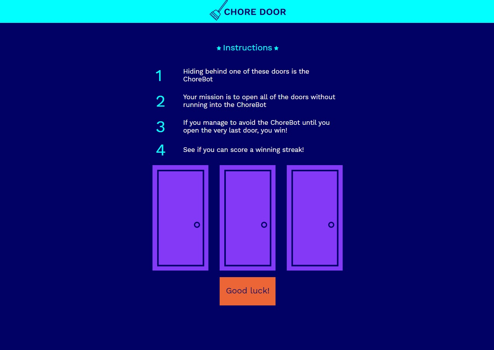
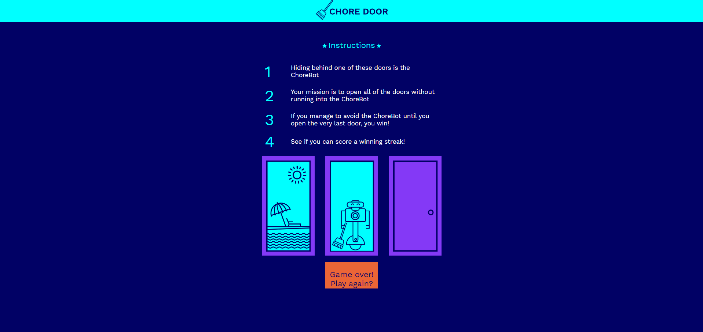
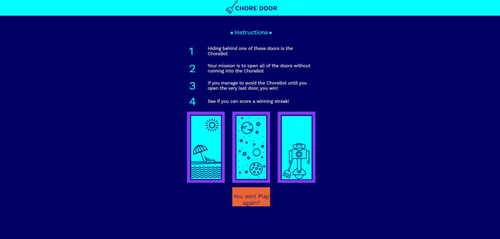

# Chore Door
> A game coded in JavaScript. Hiding behind one of the doors is the ChoreBot. Your mission is to open all of the doors without running into it. If you manage to avoid it until you open the very last door, you win! See if you can score a winning streak!. Live project: https://estebanmunchjones2019.github.io/github.io-choredoor/.

## Table of contents

* [General info](#general-info)
* [Screenshots](#screenshots)
* [Technologies](#technologies)
* [Setup](#setup)
* [Features](#features)
* [Status](#status)
* [Inspiration](#inspiration)
* [Contact](#contact)

## General info

This project was coded to learn JavaScript  while having fun building a game. The only file coded by the author was `script.js`. Make sure you play a little bit and see if you can win. 

## Screenshots

## Technologies

*  JavaScript
*  HTML
*  CSS

## Setup

* **Clone or download the repo.**

* Open the `index.html` file with your favorite browser and you're good to go.

  

## Features
List of implemented features:
* Provide a randomized position of the ChoreBot
* Reset button

List of improvements that could be done:

* Make it mobile responsive

* Keep track of the streak

  

## Status
Project is _finished_. 

## Inspiration

This project was based on [CodeCademy's Web Development career path](https://www.codecademy.com/learn/paths/web-development).

## Contact

Created by [Esteban Munch Jones](https://www.linkedin.com/in/estebanmunchjones/)- feel free to contact me.
